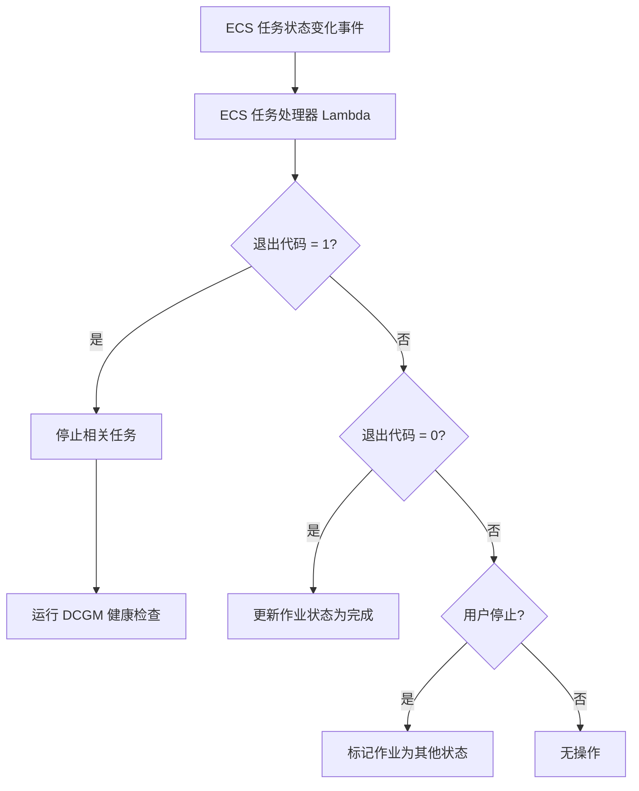
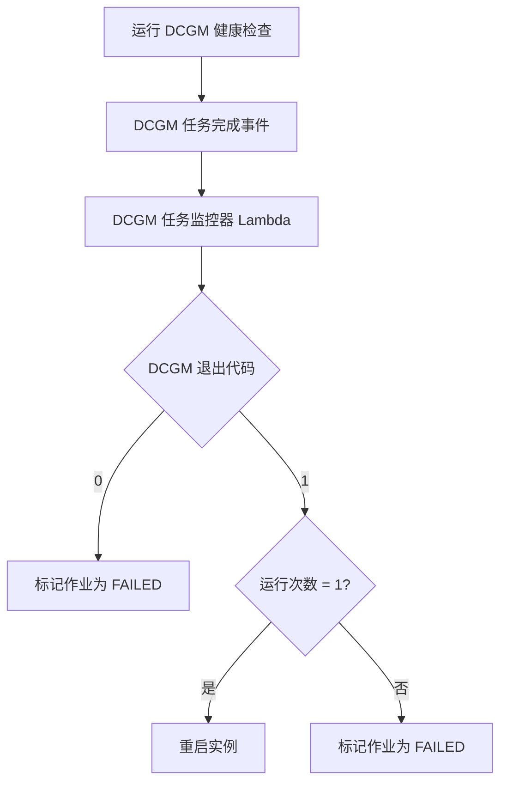
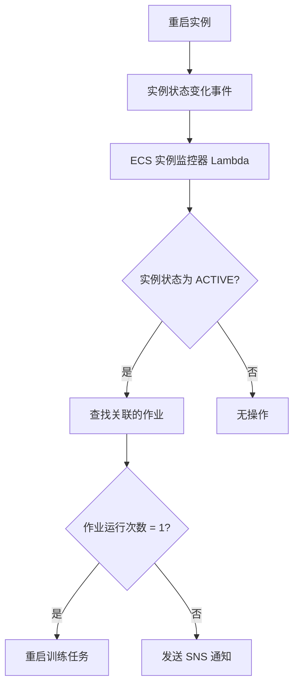

# ECS GPU 恢复系统工作流程

本文档描述了 ECS GPU 恢复系统的工作流程，该系统用于监控和自动恢复在 Amazon ECS (Elastic Container Service) 上运行的 GPU 加速任务。

## 系统架构

ECS GPU 恢复系统由以下组件组成：

- **AWS Lambda 函数**：三个 Lambda 函数处理监控和恢复的不同方面
- **Amazon DynamoDB 表**：存储作业和容器实例的状态信息
- **Amazon EventBridge 规则**：响应 ECS 事件触发 Lambda 函数
- **Amazon SNS 主题**：发送关键事件的通知

## 系统组件

### Lambda 函数

1. **ECS 任务处理器** (`ecs_task_handler.py`)
   - 监控 ECS 任务状态变化
   - 检测任务失败（退出代码 1）
   - 停止属于同一作业的其他任务
   - 触发 DCGM (NVIDIA Data Center GPU Manager) 健康检查任务
   - 当检测到失败时将作业状态更新为 'STOPPED'

2. **DCGM 任务监控器** (`dcgm_task_monitor.py`)
   - 监控 DCGM 健康检查任务的完成情况
   - 分析 DCGM 结果以确定 GPU 健康状况
   - 必要时启动实例重启
   - 在 DynamoDB 中更新作业和容器实例状态
   - 处理 DCGM 任务的不同退出代码

3. **ECS 实例监控器** (`ecs_instance_monitor.py`)
   - 监控 ECS 容器实例状态变化
   - 检测实例在重启后重新投入服务
   - 在恢复的实例上重新执行训练任务
   - 当恢复失败时通过 SNS 发送通知
   - 跟踪运行尝试次数以防止无限恢复循环

### DynamoDB 表

1. **ecs-job-sub**
   - 跟踪 GPU 训练作业状态
   - 存储有关作业、任务和恢复尝试的元数据
   - 使用 job_id_rank 作为主键

2. **ecs_container_instance**
   - 跟踪 ECS 容器实例状态
   - 记录重启和恢复操作
   - 使用 container_inst_id 作为主键

## 工作流程

### 1. 任务失败检测流程

当 ECS 任务状态变化事件发生时：
1. ECS 任务处理器 Lambda 函数被触发
2. 检查任务的退出代码
   - 如果退出代码为 1（失败）：
     - 停止属于同一作业的所有相关任务
     - 在相关容器实例上运行 DCGM 健康检查任务
     - 将作业状态更新为 'STOPPED'
   - 如果退出代码为 0（成功）：
     - 将作业状态更新为 'complete'
   - 如果是用户停止的任务：
     - 将作业状态更新为 'Other'

### 2. GPU 健康分析流程

当 DCGM 健康检查任务完成时：
1. DCGM 任务监控器 Lambda 函数被触发
2. 检查 DCGM 任务的退出代码
   - 如果退出代码为 0（DCGM 检测到 GPU 问题但不需要重启）：
     - 将作业状态更新为 'FAILED'
   - 如果退出代码为 1（DCGM 检测到需要重启的 GPU 问题）：
     - 检查作业的运行次数
       - 如果是第一次运行（retry=0）：
         - 重启容器实例
         - 更新容器实例状态为 'REBOOTING'
       - 如果不是第一次运行：
         - 将作业状态更新为 'FAILED'

### 3. 实例恢复流程

当容器实例状态变化事件发生时：
1. ECS 实例监控器 Lambda 函数被触发
2. 检查实例状态是否为 'ACTIVE'（表示实例已重启并可用）
   - 如果是 'ACTIVE'：
     - 将实例状态更新为 'AVAILABLE'
     - 查找与该实例关联的所有作业
     - 对于每个作业：
       - 检查作业的运行次数
         - 如果运行次数为 1（第一次重试）：
           - 重新执行训练任务
           - 更新运行次数为 2
         - 如果运行次数不为 1：
           - 将作业状态更新为 'fail'
           - 发送 SNS 通知给技术人员
   - 如果不是 'ACTIVE'：
     - 无操作

## 数据流

整个系统的数据流如下：

1. ECS 任务状态变化事件触发 ECS 任务处理器
2. 如果检测到任务失败，启动 DCGM 健康检查任务
3. DCGM 任务完成事件触发 DCGM 任务监控器
4. 如果需要，DCGM 任务监控器重启实例
5. 实例状态变化事件触发 ECS 实例监控器
6. ECS 实例监控器在恢复的实例上重新启动训练任务或发送失败通知

## 关键环境变量

- `TRAINING_JOB_TABLE_NAME`: 用于跟踪训练作业的 DynamoDB 表 (ecs-job-sub)
- `CONTAINER_INSTANCE_TABLE_NAME`: 用于跟踪容器实例的 DynamoDB 表 (ecs_container_instance)
- `ECS_CLUSTER_NAME`: 运行 GPU 任务的 ECS 集群名称 (nwcd-gpu-testing)
- `DCGM_HEALTH_CHECK_TASK`: DCGM 健康检查任务定义 ARN
- `SNS_TOPIC_ARN`: 用于通知的 SNS 主题 ARN (gpu-training-notifications)

## 恢复逻辑

系统的恢复逻辑基于以下原则：

1. **检测**：监控 ECS 任务的退出代码，识别可能的 GPU 相关故障
2. **诊断**：使用 NVIDIA DCGM 工具进行 GPU 健康检查
3. **恢复**：根据诊断结果，可能重启实例并重新执行训练任务
4. **通知**：当恢复失败时，通过 SNS 通知技术人员
5. **防止循环**：通过跟踪重试次数，防止无限恢复循环

这种方法确保了 GPU 加速工作负载的高可用性，同时最小化了人工干预的需求。
