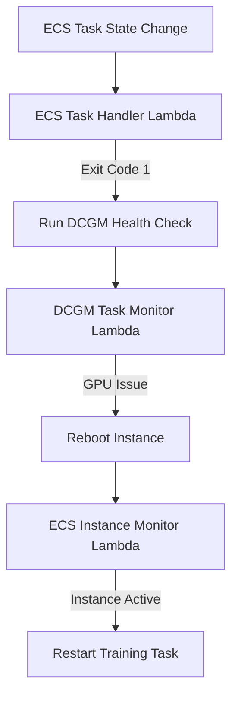

# ECS GPU Recovery System

An automated recovery system for GPU-accelerated tasks running on Amazon ECS. This system monitors task health, detects GPU failures, and provides self-healing capabilities through AWS serverless components.

## Overview

The ECS GPU Recovery system automatically detects when GPU-accelerated tasks fail, runs diagnostics to determine if the failure is GPU-related, and takes appropriate recovery actions including instance reboots and task restarts.

### Key Features

- Automatic detection of GPU task failures
- NVIDIA DCGM health checks for GPU diagnostics
- Self-healing through instance reboots
- Automatic task restart after recovery
- Notification system for unrecoverable failures
- Retry limiting to prevent infinite recovery loops

## Architecture



### Components

- **Lambda Functions**
  - **ECS Task Handler**: Monitors task failures and triggers health checks
  - **DCGM Task Monitor**: Analyzes GPU health check results
  - **ECS Instance Monitor**: Handles instance recovery and task restarts

- **DynamoDB Tables**
  - **ecs_task**: Tracks individual task status
  - **ecs_job**: Manages job status (collection of related tasks)
  - **ecs_node**: Monitors container instance health

- **Event Triggers**
  - EventBridge rules for task state changes
  - EventBridge rules for container instance state changes

## Workflow

1. When a task fails with exit code 1:
   - Related tasks are stopped
   - DCGM health check is launched on the instance

2. When DCGM health check completes:
   - If GPU issues are detected, instance is rebooted
   - Job status is updated to track recovery progress

3. When instance returns to service after reboot:
   - Training tasks are automatically restarted
   - Retry count is tracked to prevent infinite loops

4. If recovery fails after retry:
   - Notifications are sent via SNS
   - Job is marked as failed

## Setup and Deployment

This project is built using AWS CDK with Python.

### Prerequisites

- AWS CLI configured with appropriate permissions
- Python 3.13+
- AWS CDK toolkit v2.180.0+

### Installation

```bash
# Clone the repository
git clone https://github.com/yourusername/ecs-gpu-recovery.git
cd ecs-gpu-recovery

# Create and activate virtual environment
python -m venv .venv
source .venv/bin/activate  # Unix/macOS
.venv\Scripts\activate.bat  # Windows

# Install dependencies
pip install -r requirements.txt
```

### Deployment

```bash
# Synthesize CloudFormation template
cdk synth

# Deploy the stack
cdk deploy
```

### Configuration

Key environment variables:

- `TASK_TABLE_NAME`: DynamoDB table for tracking tasks
- `JOB_TABLE_NAME`: DynamoDB table for tracking jobs
- `NODE_TABLE_NAME`: DynamoDB table for tracking nodes
- `ECS_CLUSTER_NAME`: Name of the ECS cluster
- `DCGM_HEALTH_CHECK_TASK`: Task definition ARN for DCGM health check
- `SNS_TOPIC_NAME`: SNS topic for notifications

## Testing

The project includes integration tests using mock containers:

```bash
# Run the test suite
python tests/integration/test_gpu_recovery_workflow.py

# Run with custom parameters
python tests/integration/test_gpu_recovery_workflow.py \
  --cluster your-cluster-name \
  --task-table your-task-table \
  --job-table your-job-table \
  --node-table your-node-table
```

The test suite creates mock task definitions that simulate GPU failures and recovery scenarios.

## License

[Your License Here]
