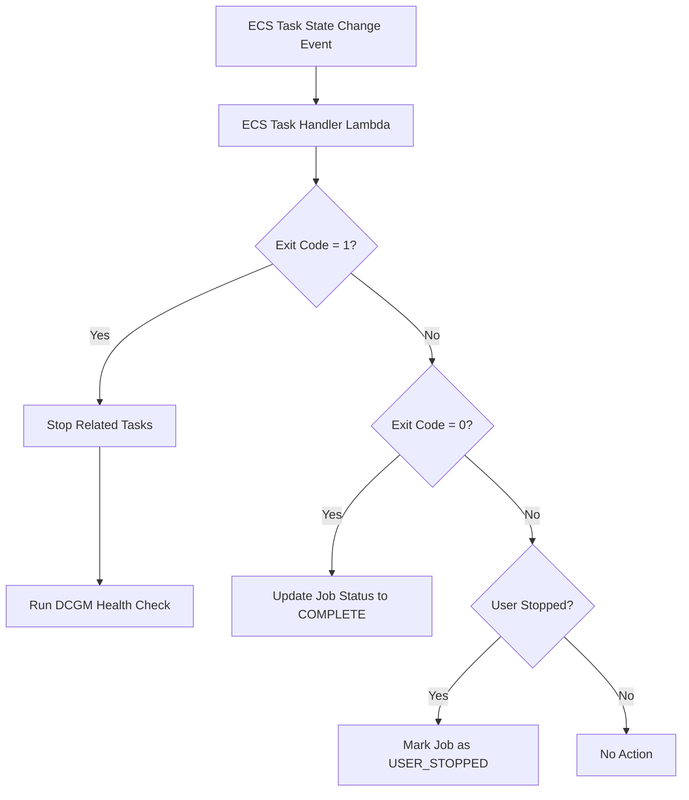
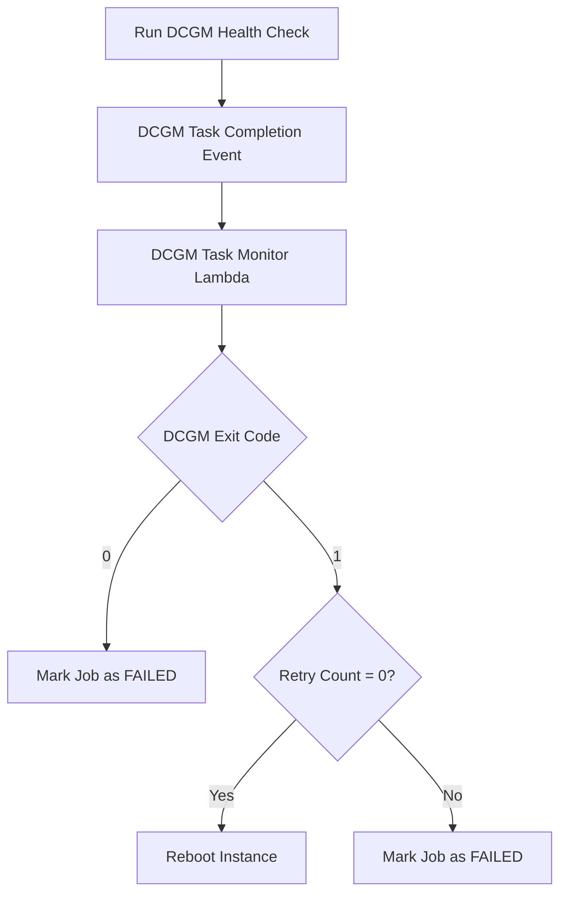
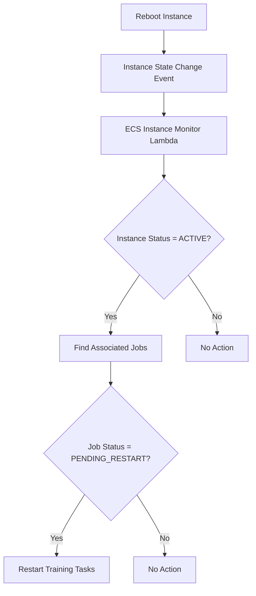

# ECS GPU Recovery System Workflow

This document describes the workflow of the ECS GPU Recovery system, which monitors and automatically recovers GPU-accelerated tasks running on Amazon ECS (Elastic Container Service).

## System Architecture

The ECS GPU Recovery system consists of the following components:

- **AWS Lambda Functions**: Three Lambda functions handle different aspects of monitoring and recovery
- **Amazon DynamoDB Tables**: Store state information for jobs and container instances
- **Amazon EventBridge Rules**: Trigger Lambda functions in response to ECS events
- **Amazon SNS Topic**: Send notifications for critical events

## System Components

### Lambda Functions

1. **ECS Task Handler** (`ecs_task_handler.py`)
   - Monitors ECS task state changes
   - Detects task failures (exit code 1)
   - Stops other tasks belonging to the same job
   - Triggers DCGM (NVIDIA Data Center GPU Manager) health check tasks
   - Updates job status to 'PENDING_HEALTHCHECK' when failure is detected

2. **DCGM Task Monitor** (`dcgm_task_monitor.py`)
   - Monitors completion of DCGM health check tasks
   - Analyzes DCGM results to determine GPU health
   - Initiates instance reboots when necessary
   - Updates job and container instance states in DynamoDB
   - Handles different exit codes from DCGM tasks

3. **ECS Instance Monitor** (`ecs_instance_monitor.py`)
   - Monitors ECS container instance state changes
   - Detects when instances come back online after reboot
   - Re-executes training tasks on recovered instances
   - Sends notifications via SNS when recovery fails
   - Tracks retry attempts to prevent infinite recovery loops

### DynamoDB Tables

1. **ecs_task**
   - Tracks GPU training task status
   - Stores metadata about tasks, jobs, and retry attempts
   - Uses `ecs_task_id` as primary key

2. **ecs_job**
   - Tracks job status (collection of related tasks)
   - Stores metadata about jobs and recovery attempts
   - Uses `job_id` as primary key

3. **ecs_node**
   - Tracks container instance status
   - Records reboot and recovery operations
   - Uses `node_name` as primary key

## Workflow

### 1. Task Failure Detection Process

When an ECS task state change event occurs:
1. The ECS Task Handler Lambda function is triggered
2. It checks the task's exit code
   - If exit code is 1 (failure):
     - Stops all related tasks belonging to the same job
     - Runs a DCGM health check task on the relevant container instance
     - Updates job status to 'PENDING_HEALTHCHECK'
   - If exit code is 0 (success):
     - Updates job status to 'COMPLETE'
   - If task was stopped by user:
     - Updates job status to 'USER_STOPPED'

### 2. GPU Health Analysis Process

When a DCGM health check task completes:
1. The DCGM Task Monitor Lambda function is triggered
2. It checks the DCGM task's exit code
   - If exit code is 0 (DCGM detected GPU issue but no reboot needed):
     - Updates job status to 'FAILED'
   - If exit code is 1 (DCGM detected GPU issue requiring reboot):
     - Checks job's retry count
       - If first run (retry=0):
         - Reboots container instance
         - Updates container instance status to 'REBOOTING'
       - If not first run:
         - Updates job status to 'FAILED'

### 3. Instance Recovery Process

When a container instance state change event occurs:
1. The ECS Instance Monitor Lambda function is triggered
2. It checks if instance status is 'ACTIVE' (indicating instance has rebooted and is available)
   - If 'ACTIVE':
     - Updates instance status to 'AVAILABLE'
     - Finds all jobs associated with this instance
     - For each job:
       - If job status is 'PENDING_RESTART':
         - Re-executes training tasks
         - Updates retry count
       - If job status is not 'PENDING_RESTART':
         - No action
   - If not 'ACTIVE':
     - No action

## Data Flow

The overall data flow in the system is as follows:

1. ECS task state change event triggers ECS Task Handler
2. If task failure is detected, a DCGM health check task is launched
3. DCGM task completion event triggers DCGM Task Monitor
4. If needed, DCGM Task Monitor reboots the instance
5. Instance state change event triggers ECS Instance Monitor
6. ECS Instance Monitor restarts training tasks on recovered instance or sends failure notification

## Key Environment Variables

- `TASK_TABLE_NAME`: DynamoDB table for tracking tasks (ecs_task)
- `JOB_TABLE_NAME`: DynamoDB table for tracking jobs (ecs_job)
- `NODE_TABLE_NAME`: DynamoDB table for tracking nodes (ecs_node)
- `ECS_CLUSTER_NAME`: ECS cluster name running GPU tasks
- `DCGM_HEALTH_CHECK_TASK`: DCGM health check task definition ARN
- `SNS_TOPIC_ARN`: SNS topic ARN for notifications

## Recovery Logic

The system's recovery logic is based on the following principles:

1. **Detection**: Monitor ECS task exit codes to identify potential GPU-related failures
2. **Diagnosis**: Use NVIDIA DCGM tools to perform GPU health checks
3. **Recovery**: Based on diagnosis results, potentially reboot instance and re-execute training tasks
4. **Notification**: When recovery fails, notify technical staff via SNS
5. **Loop Prevention**: Track retry attempts to prevent infinite recovery loops

This approach ensures high availability for GPU-accelerated workloads while minimizing the need for manual intervention.
