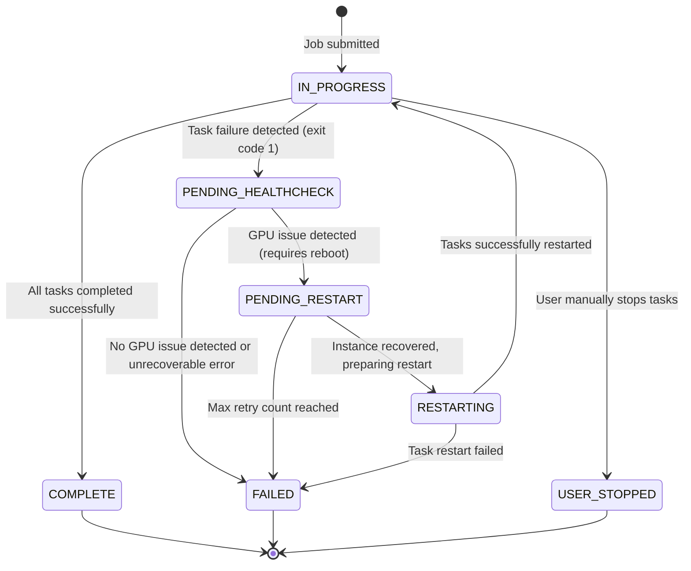

# Job State Transition Graph

This document describes the state transitions for jobs in the GPU Recovery system. A job represents a collection of related tasks that form a logical unit of work.

## State Diagram

## Job States

| State | Description |
|-------|-------------|
| IN_PROGRESS | Job is currently running with tasks executing on container instances |
| PENDING_HEALTHCHECK | A task failure was detected, and DCGM health check is running to determine GPU health |
| PENDING_RESTART | GPU issue detected, instance rebooted, job is waiting to be restarted |
| RESTARTING | Job is in the process of being restarted after instance recovery |
| COMPLETE | All tasks completed successfully with exit code 0 |
| FAILED | Job failed after exhausting retry attempts or due to unrecoverable errors |
| USER_STOPPED | Job was manually stopped by a user |

## State Transitions

### [*] → IN_PROGRESS
- **Trigger**: Job is submitted with one or more tasks
- **Action**:
  - Create job record in DynamoDB with status `IN_PROGRESS`
  - Create task records for each task in the job

### IN_PROGRESS → PENDING_HEALTHCHECK
- **Trigger**: Task fails with exit code 1
- **Action**:
  - Update job status to `PENDING_HEALTHCHECK`
  - Stop all other tasks in the job
  - Launch DCGM health check task on the affected instance

### IN_PROGRESS → COMPLETE
- **Trigger**: All tasks complete successfully (exit code 0)
- **Action**:
  - Update job status to `COMPLETE`
  - Release container instance resources

### IN_PROGRESS → USER_STOPPED
- **Trigger**: User manually stops one or more tasks in the job
- **Action**:
  - Update job status to `USER_STOPPED`
  - Release container instance resources

### PENDING_HEALTHCHECK → PENDING_RESTART
- **Trigger**: DCGM health check detects GPU issue requiring reboot (exit code 1)
- **Action**:
  - Update job status to `PENDING_RESTART`
  - Reboot the affected container instance

### PENDING_HEALTHCHECK → FAILED
- **Trigger**: DCGM health check completes with no GPU issue detected (exit code 0)
- **Action**:
  - Update job status to `FAILED`
  - Release container instance resources

### PENDING_RESTART → RESTARTING
- **Trigger**: Container instance becomes active after reboot
- **Action**:
  - Update job status to `RESTARTING`
  - Prepare to restart tasks on the recovered instance

### PENDING_RESTART → FAILED
- **Trigger**: Job retry count exceeds maximum allowed retries
- **Action**:
  - Update job status to `FAILED`
  - Send notification via SNS
  - Release container instance resources

### RESTARTING → IN_PROGRESS
- **Trigger**: Tasks are successfully restarted on the recovered instance
- **Action**:
  - Update job status to `IN_PROGRESS`
  - Increment retry count

### RESTARTING → FAILED
- **Trigger**: Task restart fails
- **Action**:
  - Update job status to `FAILED`
  - Send notification via SNS
  - Release container instance resources

## Implementation Details

Job state transitions are handled by three Lambda functions:

1. **ECS Task Handler**: Handles transitions to `PENDING_HEALTHCHECK` when task failures are detected
2. **DCGM Task Monitor**: Handles transitions to `PENDING_RESTART` or `FAILED` based on health check results
3. **ECS Instance Monitor**: Handles transitions from `PENDING_RESTART` to `RESTARTING` to `IN_PROGRESS` or `FAILED`

The job state is stored in the DynamoDB `ecs_job` table and is updated by these Lambda functions as events occur in the system.
