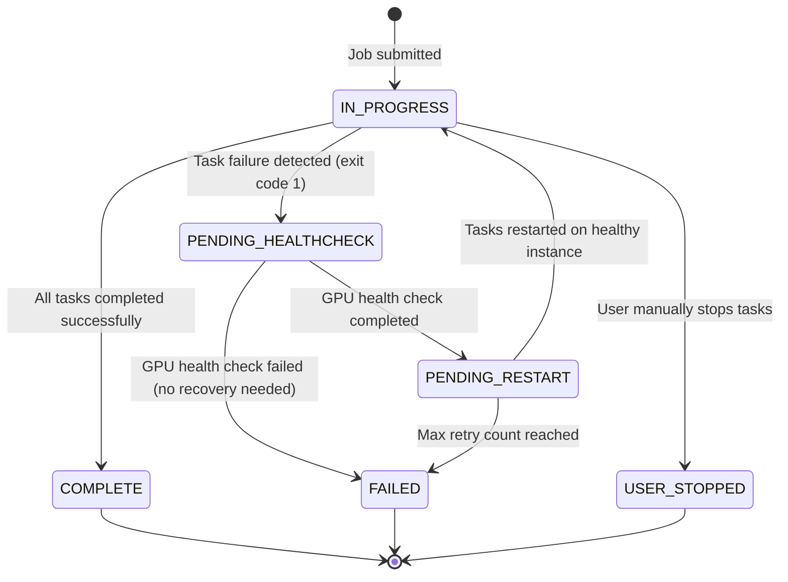

# Job State Transition Graph

## Job States Description

| State | Description |
|-------|-------------|
| IN_PROGRESS | Job is currently running with tasks executing on container instances |
| PENDING_HEALTHCHECK | A task failure was detected, and DCGM health check is running to determine GPU health |
| PENDING_RESTART | GPU issue detected, instance rebooted, job is waiting to be restarted |
| COMPLETE | All tasks completed successfully with exit code 0 |
| FAILED | Job failed after exhausting retry attempts or due to unrecoverable errors |
| USER_STOPPED | Job was manually stopped by a user |

## Key Transitions

1. When a job is submitted, it starts in the `IN_PROGRESS` state
2. If a task fails with exit code 1, the job transitions to `PENDING_HEALTHCHECK`
3. After health check completes:
   - If GPU recovery is needed, job transitions to `PENDING_RESTART`
   - If no recovery is needed but job failed, transitions to `FAILED`
4. When instance becomes available after reboot:
   - If retry count < max, job transitions back to `IN_PROGRESS`
   - If retry count >= max, job transitions to `FAILED`
5. When all tasks complete successfully, job transitions to `COMPLETE`
6. If user manually stops tasks, job transitions to `USER_STOPPED`
