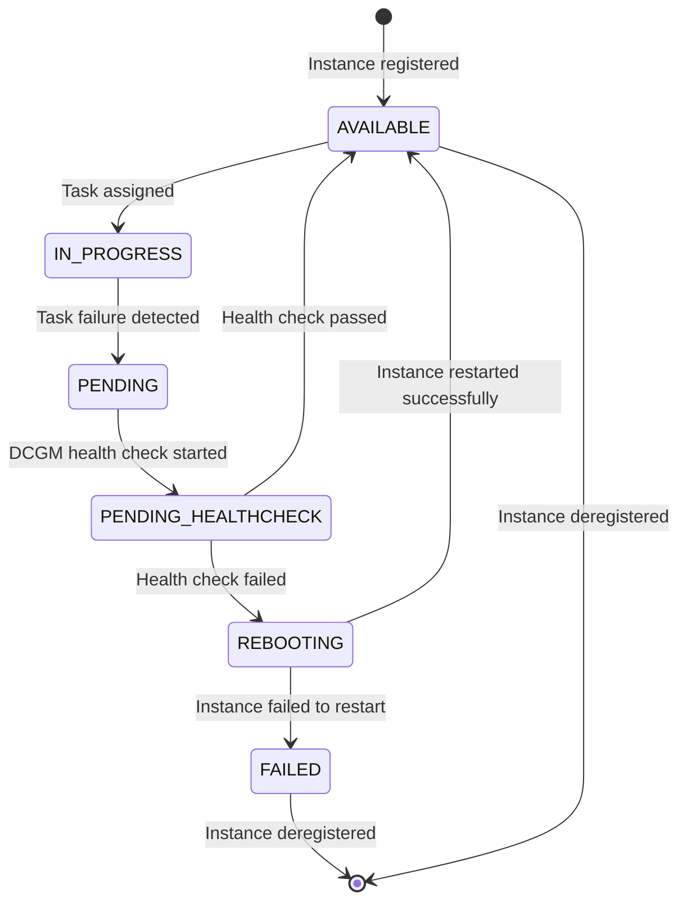

# Node (Container Instance) State Transition Graph

This document describes the state transitions for container instances (nodes) in the GPU Recovery system.

## State Diagram



## Node States

| State | Description |
|-------|-------------|
| AVAILABLE | Node is healthy and available to run tasks |
| IN_PROGRESS | Node is currently running tasks |
| PENDING | Task failure detected, node is waiting for health check |
| PENDING_HEALTHCHECK | DCGM health check is running on the node |
| REBOOTING | Node is being rebooted due to GPU issue |
| FAILED | Node has failed health check and is marked as unhealthy |

## State Transitions

### [*] → AVAILABLE
- **Trigger**: Container instance is registered with the ECS cluster
- **Action**:
  - Create node record in DynamoDB with status `AVAILABLE`
  - Mark instance as available for task placement

### AVAILABLE → IN_PROGRESS
- **Trigger**: Task is assigned to the container instance
- **Action**:
  - Update node status to `IN_PROGRESS`
  - Associate node with the running task

### IN_PROGRESS → PENDING
- **Trigger**: Task fails with exit code 1
- **Action**:
  - Update node status to `PENDING`
  - Prepare for health check

### PENDING → PENDING_HEALTHCHECK
- **Trigger**: DCGM health check task is started on the instance
- **Action**:
  - Update node status to `PENDING_HEALTHCHECK`

### PENDING_HEALTHCHECK → AVAILABLE
- **Trigger**: DCGM health check completes with no GPU issues detected
- **Action**:
  - Update node status to `AVAILABLE`
  - Make instance available for new tasks

### PENDING_HEALTHCHECK → REBOOTING
- **Trigger**: DCGM health check detects GPU issue requiring reboot
- **Action**:
  - Update node status to `REBOOTING`
  - Initiate instance reboot via SSM command

### REBOOTING → AVAILABLE
- **Trigger**: Instance completes reboot and returns to service
- **Action**:
  - Update node status to `AVAILABLE`
  - Make instance available for task restart

### REBOOTING → FAILED
- **Trigger**: Instance fails to return to service after reboot
- **Action**:
  - Update node status to `FAILED`
  - Send notification via SNS

### AVAILABLE → [*]
- **Trigger**: Instance is deregistered from the cluster
- **Action**:
  - Remove node record or mark as deregistered

### FAILED → [*]
- **Trigger**: Instance is deregistered from the cluster
- **Action**:
  - Remove node record or mark as deregistered

## Node Recovery Process

```mermaid
flowchart TD
    A[Task Failure Detected] --> B[Mark Node as PENDING]
    B --> C[Run DCGM Health Check]
    C --> D[Mark Node as PENDING_HEALTHCHECK]
    D --> E{Health Check Result}

    E -->|No GPU Issue| F[Mark Node as AVAILABLE]
    E -->|GPU Issue| G[Mark Node as REBOOTING]

    G --> H[Reboot Instance]
    H --> I[Instance Returns to Service]
    I --> J[Mark Node as AVAILABLE]

    F --> K[Resume Normal Operation]
    J --> K

## Implementation Details

Node state transitions are handled by three Lambda functions:

1. **ECS Task Handler**: Handles transitions to `PENDING` and `PENDING_HEALTHCHECK` when task failures are detected
2. **DCGM Task Monitor**: Handles transitions to `REBOOTING` based on health check results
3. **ECS Instance Monitor**: Handles transitions from `REBOOTING` to `AVAILABLE` when instances return to service

The node state is stored in the DynamoDB `ecs_node` table and is updated by these Lambda functions as events occur in the system. Additionally, ECS container instance attributes are used to track state within the ECS service itself.
