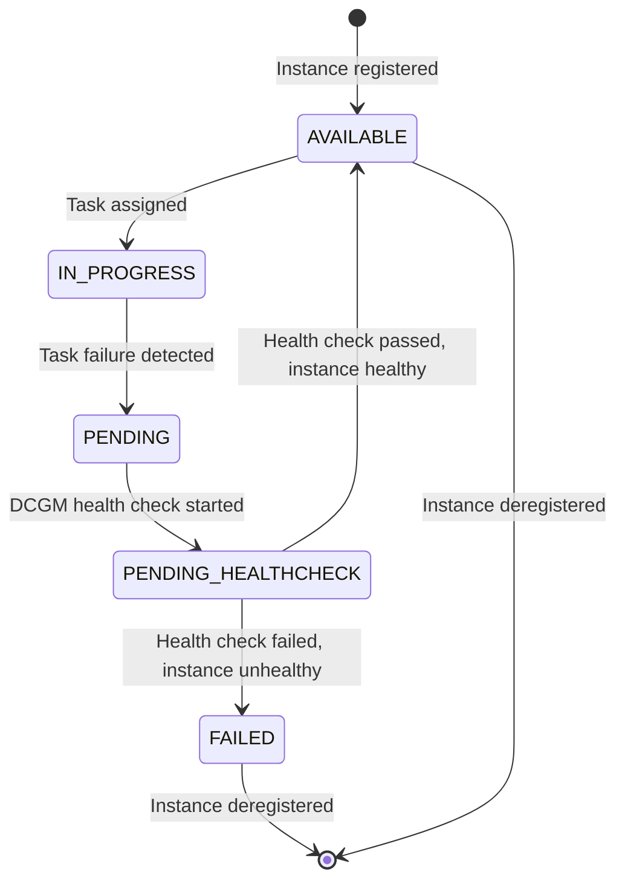

# Node (Container Instance) State Transition Graph



## Node States Description

| State | Description |
|-------|-------------|
| AVAILABLE | Node is healthy and available to run tasks |
| IN_PROGRESS | Node is currently running tasks |
| PENDING | Task failure detected, node is waiting for health check |
| PENDING_HEALTHCHECK | DCGM health check is running on the node |
| FAILED | Node has failed health check and is marked as unhealthy |

## Key Transitions

1. When a container instance is registered with the ECS cluster, it starts in the `AVAILABLE` state
2. When a task is assigned to the instance, it transitions to `IN_PROGRESS`
3. If a task fails with exit code 1, the instance transitions to `PENDING`
4. When DCGM health check starts, the instance transitions to `PENDING_HEALTHCHECK`
5. After health check completes:
   - If the GPU is healthy, instance transitions back to `AVAILABLE`
   - If the GPU is unhealthy, instance transitions to `FAILED`
6. A failed instance may be deregistered from the cluster

## Node Recovery Process

```mermaid
flowchart TD
    A[Task Failure Detected] --> B{Is GPU Issue?}
    B -->|Yes| C[Mark Node as PENDING]
    B -->|No| D[Keep Node as AVAILABLE]

    C --> E[Run DCGM Health Check]
    E --> F{Health Check Result}

    F -->|Pass| G[Mark Node as AVAILABLE]
    F -->|Fail| H[Mark Node as FAILED]

    H --> I[Reboot Instance]
    I --> J[Instance Returns to Service]
    J --> K[Mark Node as AVAILABLE]

    G --> L[Resume Normal Operation]
    K --> L
