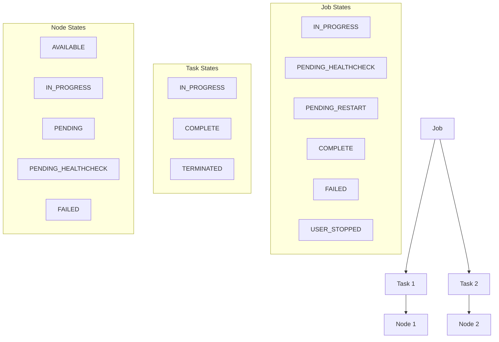
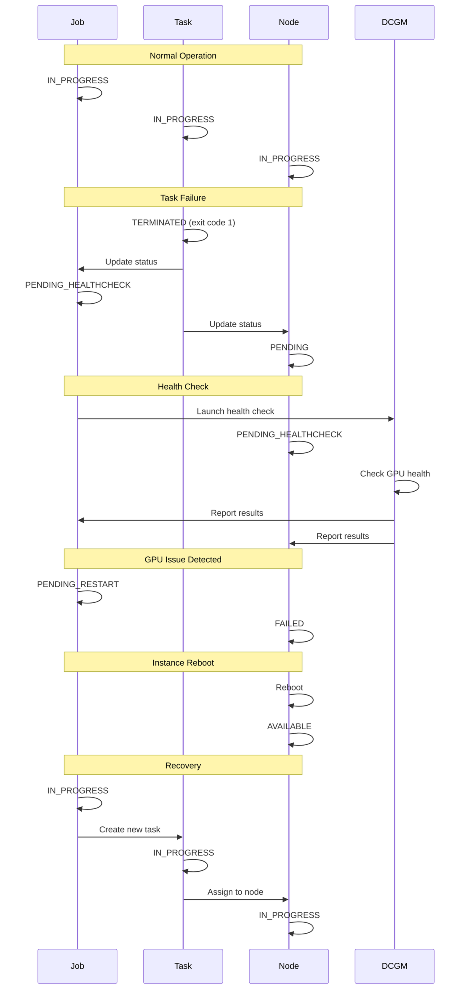

# ECS GPU Recovery System State Graphs Summary

This document provides a summary of the state transitions for the three main components of the ECS GPU Recovery System: Jobs, Tasks, and Nodes (Container Instances).

## Component Relationships

## State Transition Interactions

The three components (Jobs, Tasks, and Nodes) interact with each other during the recovery process:

1. **Task Failure Triggers Job and Node State Changes**:
   - When a task transitions from `IN_PROGRESS` to `TERMINATED` (exit code 1)
   - The associated job transitions from `IN_PROGRESS` to `PENDING_HEALTHCHECK`
   - The associated node transitions from `IN_PROGRESS` to `PENDING`

2. **DCGM Health Check Process**:
   - When DCGM health check starts:
     - Node transitions from `PENDING` to `PENDING_HEALTHCHECK`
   - When DCGM health check completes:
     - Job transitions from `PENDING_HEALTHCHECK` to `PENDING_RESTART` (if GPU issue detected)
     - Node transitions from `PENDING_HEALTHCHECK` to `FAILED` (if GPU issue detected)

3. **Recovery Process**:
   - When node becomes available after reboot:
     - Node transitions from `FAILED` to `AVAILABLE`
     - Job transitions from `PENDING_RESTART` to `IN_PROGRESS`
     - New tasks are created in `IN_PROGRESS` state

4. **Successful Completion**:
   - When all tasks transition to `COMPLETE`:
     - Job transitions to `COMPLETE`
     - Nodes remain in `AVAILABLE` state

## Recovery Workflow Sequence

## Key Points

1. **Job State** represents the overall status of a batch of related tasks
2. **Task State** represents the status of individual container executions
3. **Node State** represents the health and availability of container instances

The recovery system monitors these states and transitions between them to:
- Detect GPU failures through task exit codes
- Verify GPU health using DCGM health checks
- Recover from failures by rebooting instances and restarting tasks
- Track retry attempts to prevent infinite recovery loops
- Notify administrators when recovery fails

For detailed state transitions of each component, refer to the individual state graph files:
- [Job State Graph](job_state_graph.md)
- [Task State Graph](task_state_graph.md)
- [Node State Graph](node_state_graph.md)
