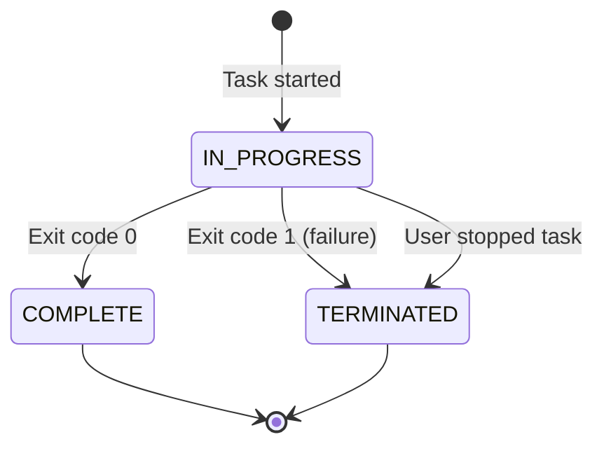

# Task State Transition Graph



## Task States Description

| State | Description |
|-------|-------------|
| IN_PROGRESS | Task is currently running on a container instance |
| COMPLETE | Task completed successfully with exit code 0 |
| TERMINATED | Task was terminated due to failure or user intervention |

## Key Transitions

1. When a task is started, it enters the `IN_PROGRESS` state
2. If the task completes successfully (exit code 0), it transitions to `COMPLETE`
3. If the task fails (exit code 1), it transitions to `TERMINATED`
4. If a user manually stops the task, it transitions to `TERMINATED`
5. When a task is restarted after a failure:
   - The original task remains in `TERMINATED` state
   - A new task record is created with the same job ID but a new task ID in `IN_PROGRESS` state
   - The retry count is incremented for the new task

## Task Lifecycle in Recovery Process

```mermaid
sequenceDiagram
    participant Task as Original Task
    participant Job as Job Record
    participant DCGM as DCGM Health Check
    participant NewTask as New Task

    Task->>Task: Running (IN_PROGRESS)
    Task->>Task: Failure (Exit code 1)
    Task->>Job: Update job status to PENDING_HEALTHCHECK
    Task->>Task: Update status to TERMINATED
    Job->>DCGM: Launch health check task
    DCGM->>DCGM: Check GPU health
    DCGM->>Job: Update job status to PENDING_RESTART
    Job->>NewTask: Create new task with incremented retry count
    NewTask->>NewTask: Running (IN_PROGRESS)
    NewTask->>Job: Update job status to IN_PROGRESS
