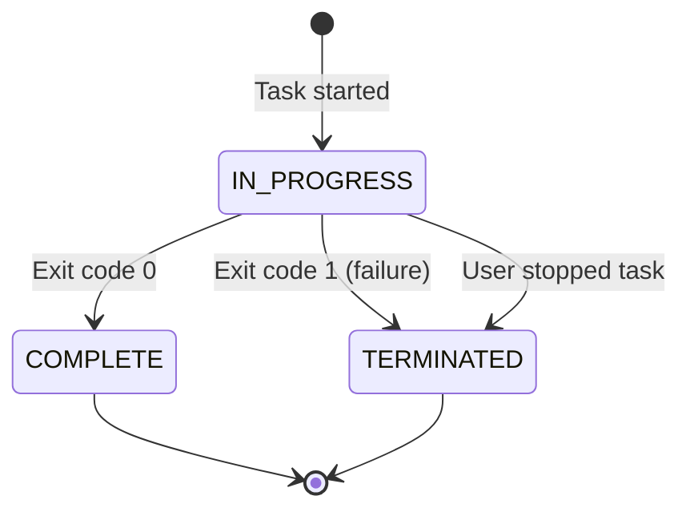
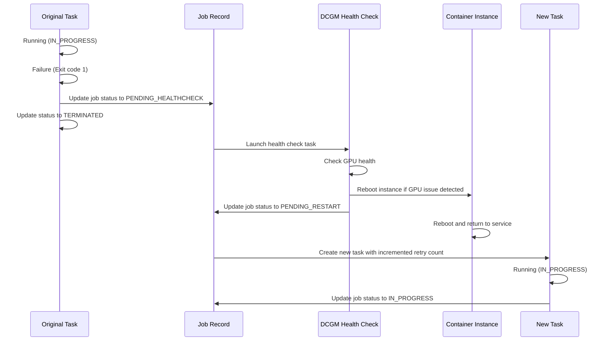

# Task State Transition Graph

This document describes the state transitions for individual ECS tasks in the GPU Recovery system.

## State Diagram

## Task States

| State | Description |
|-------|-------------|
| IN_PROGRESS | Task is currently running on a container instance |
| COMPLETE | Task completed successfully with exit code 0 |
| TERMINATED | Task was terminated due to failure or user intervention |

## State Transitions

### [*] → IN_PROGRESS
- **Trigger**: Task is started on a container instance
- **Action**:
  - Create task record in DynamoDB with status `IN_PROGRESS`
  - Associate task with job ID and container instance

### IN_PROGRESS → COMPLETE
- **Trigger**: Task completes with exit code 0
- **Action**:
  - Update task status to `COMPLETE` in DynamoDB
  - Check if all tasks in job are complete
  - If all tasks are complete, update job status to `COMPLETE`
  - Release container instance resources

### IN_PROGRESS → TERMINATED (Exit Code 1)
- **Trigger**: Task completes with exit code 1 (failure)
- **Action**:
  - Update task status to `TERMINATED` in DynamoDB
  - Stop all other tasks in the same job
  - Update job status to `PENDING_HEALTHCHECK`
  - Launch DCGM health check task on the instance
  - Update node status to `PENDING`

### IN_PROGRESS → TERMINATED (User Stopped)
- **Trigger**: User manually stops the task
- **Action**:
  - Update task status to `TERMINATED` in DynamoDB
  - Check if all tasks in job are stopped
  - If all tasks are stopped, update job status to `USER_STOPPED`

## Task Lifecycle During Recovery

When a task fails and the system determines a GPU issue requires recovery:

1. Original task is marked as `TERMINATED`
2. Container instance is rebooted
3. After instance recovery, a new task is created:
   - New task has same job ID but new task ID
   - New task starts in `IN_PROGRESS` state
   - Retry count is incremented for the new task

## Implementation Details

Task state transitions are primarily handled by the `TaskProcessor` class in the ECS Task Handler Lambda function. The processor:

1. Monitors EventBridge events for task state changes
2. Extracts task exit codes from container information
3. Updates task status in DynamoDB
4. Triggers appropriate recovery actions based on exit codes
5. Coordinates with job and node state management

Task records in DynamoDB maintain the complete history of task executions, including original tasks and their retried versions, allowing for comprehensive tracking of the recovery process.
